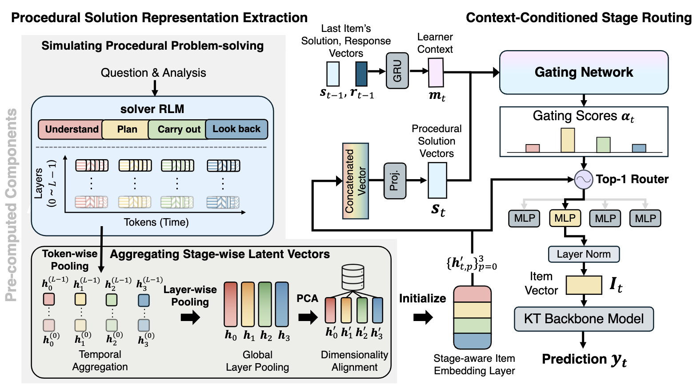

# Behavior-Aware Item Modeling via Dynamic Procedural Solution Representations for Knowledge Tracing
<div align="center">


### 🔥 **Accepted to ACL Findings 2026!!!**

[Paper](https://arxiv.org/abs/2604.08260) | [Quick Start](#environment)
<hr>
</div>

## Overview



**BAIM (Behavior-Aware Item Modeling)** introduces **procedural item representations** that capture the dynamics of problem-solving. Instead of static embeddings, BAIM models problems through four reasoning stages: **Understand, Plan, Carry Out, and Look Back**. Using **adaptive routing**, it dynamically integrates these stages into KT models, significantly improving performance and cross-student generalization across five major backbones.

---

## Results


#### XES3G5M

| Model | AKT | qDKT | QIKT | simpleKT | sparseKT |
|------|-----|------|------|----------|----------|
| Default | 81.56±0.06 | 81.69±0.04 | 81.67±0.01 | 81.26±0.01 | 80.37±0.04 |
| BAIM (Ours) | 83.00 (+1.44) | 82.43 (+0.74) | 82.17 (+0.50) | 82.84 (+1.58) | 83.21 (+2.84) |
#### NIPS34

| Model | AKT | qDKT | QIKT | simpleKT | sparseKT |
|------|-----|------|------|----------|----------|
| Default | 79.89±0.07 | 79.24±0.08 | 79.95±0.07 | 79.90±0.01 | 79.30±0.08 |
| BAIM (Ours) | 80.16 (+0.27) | 80.13 (+0.89) | 80.18 (+0.23) | 80.02 (+0.12) | 80.36 (+1.06) |

---

## Environment

- Python 3.12 with a repo-local virtualenv at `.venv`.
- Managed via `uv`.

Set up the environment:

```bash
uv sync
```

Verify:

```bash
uv run python -c "import torch; print(torch.__version__)"
```

All training scripts auto-activate `.venv` and run on a single GPU sequentially across folds (0→4).

## Data

- Dataset files are under `src/pykt-toolkit/data/nips_task34`.
- Config resolves data with `dpath = ../data/nips_task34` relative to `src/pykt-toolkit/train_test`.

## Embeddings

Place the BAIM embedding file here:

- `embedding/nips_task34/polya_tensor_all_layers_mean_pca768.pt`

The run scripts reference:

- `EMB_PATH="../../../embedding/${DATASET}/polya_tensor_all_layers_mean_pca768.pt"`

If you use a different dataset (e.g., `xes3g5m`), set `DATASET` accordingly or adjust folder names under `embedding/`.

---

## Training

From the repo root:

```bash
cd src/pykt-toolkit/train_test
```

Train one architecture across 5 folds:

```bash
./run_qdkt_baim.sh
# or: ./run_akt_baim.sh, ./run_qikt_baim.sh, ./run_simplekt_baim.sh, ./run_sparsekt_baim.sh
```

Run prediction/evaluation for all fold checkpoints at once:

```bash
uv run python -m wandb_predict --save_dir saved_model/qdkt
# replace qdkt with: akt, qikt, simplekt, sparsekt
```

If your dataset does not have window split files, run:

```bash
uv run python -m wandb_predict --save_dir saved_model/qdkt --skip_window_eval 1
```

The command above evaluates all fold subdirectories under `saved_model/<model>` and prints
`testauc mean +- std` in the terminal. It also saves a summary file at:

- `saved_model/<model>/prediction_results_summary.json`

Notes:
- Each script loops folds `0 1 2 3 4` serially on `CUDA_VISIBLE_DEVICES=0`.
- `wandb_predict` auto-disables window evaluation when window files are missing.
- Weights & Biases logging is enabled; set your API key if needed:

```bash
export WANDB_API_KEY="<your_key>"
```

---

## Reproduce BAIM Procedural Solution Representation

This section is for users who want to reproduce BAIM's **procedural solution representation** pipeline:

1. Extract per-problem procedural solutions and raw trajectories.
2. Build stage-level embeddings by layer-wise mean pooling.
3. Apply PCA only after embeddings from all problems are collected.

### 1) Download Public Data

Download datasets from the official public sources:

- NIPS34: https://www.eedi.com/research
- XES3G5M: https://github.com/ai4ed/XES3G5M.git

Place metadata/question files under dataset roots as expected by config, for example:

- `NIPS34/metadata/question_en.json`
- `XES3G5M/metadata/questions_en.json`

### 2) Prepare Image Roots

Put images under each dataset image root (configured in `src/configs/extract.yaml`):

- `NIPS34/metadata/images`
- `XES3G5M/metadata/images`

If a problem references images and files are missing, extraction will continue but those images are not used.

### 3) Configure Extraction

Edit `src/configs/extract.yaml`:

- `dataset`: `NIPS34` or `XES3G5M`
- `paths.images_root`: typically `{dataset}/metadata/images`
- `run` section: `limit`, `start_index`, `include_trajectory`, `output_name` as needed

Run extraction:

```bash
python src/extract.py --config src/configs/extract.yaml
```

This writes solution JSONL and per-problem raw trajectory `.pt` files under `paths.save_dir`.

### 4) Configure Embedding Processing

Edit `src/configs/process.yaml`:

- `dataset`: `NIPS34` or `XES3G5M`
- `io.base`: root directory containing per-index folders (`0`, `1`, ...), each with stage files (`understand.pt`, `plan.pt`, `carry_out.pt`, `look_back.pt`)
- `shape`: expected embedding dimensions (`expected_d`) and optional fixed `expected_t`
- `pca`: PCA hyperparameters (`n_components`, `svd_solver`, `random_state`)
- `run`: index range and behavior (`start`, `end`, `skip_bad`, `rebuild_mean`)

Run processing:

```bash
python src/process.py --config src/configs/process.yaml
```

Outputs:

- Layer-mean stage tensor: `io.mean_out`
- PCA-compressed stage tensor: `io.pca_out`

The PCA step is applied after all selected problems are pooled and aggregated.

---

## Citation

If you find this repository, dataset, or code useful for your research, please consider citing our paper.

```bibtex
@article{seo2026behavior,
  title={Behavior-Aware Item Modeling via Dynamic Procedural Solution Representations for Knowledge Tracing},
  author={Seo, Jun and Ryu, Sangwon and Do, Heejin and Kim, Hyounghun and Lee, Gary Geunbae},
  journal={arXiv preprint arXiv:2604.08260},
  year={2026}
}
```
